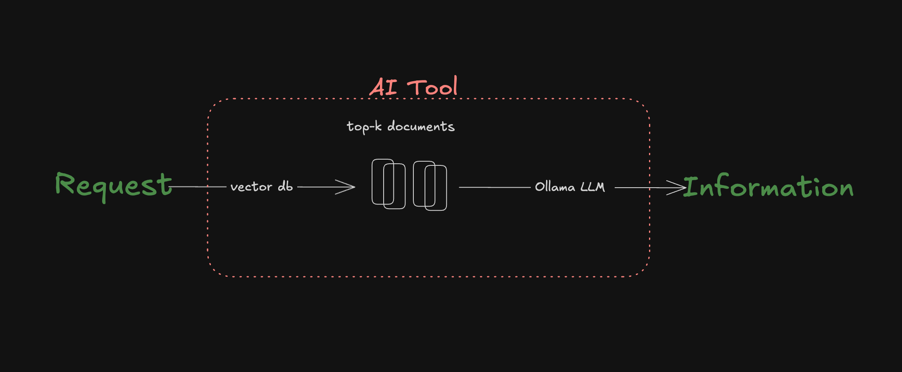

# Daley Fraser Solution
(note to self) in vscode use ```cmd+shift+v``` to preview md for editing readme<br/>



## How to run
1. pip install -r requirements.txt
2. make prepare
3. make run

## Benchmark to test iterations
| # | Question | Answer | Source |
|---|-----------|----------------------|-----------|
| 1 | what is the preferred specimen for 1,25-Dihydroxyvitamin D, Serum | 2.0 mL of serum, obtained from blood collected in a plain red-top or serum separator tube (SST). | Synthetic_Procedures/1_25-DIHYDROXYVITAMIN_D_SERUM.pdf
| 2 |  |  |  |
| 3 |  |  |  |
| 4 |  |  |  |
| 5 |  |  |  |